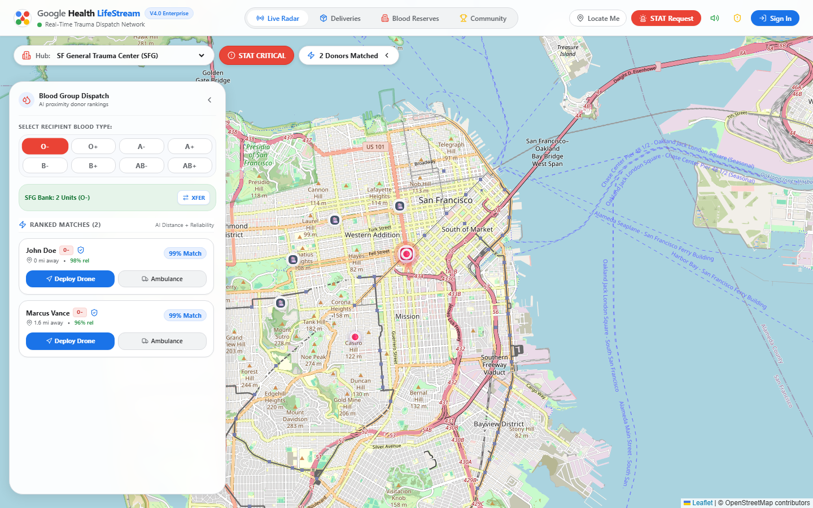
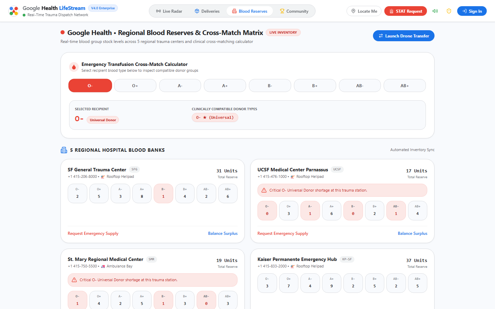
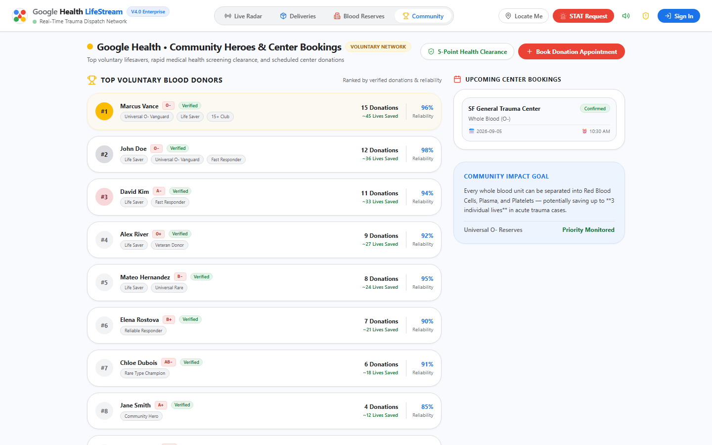
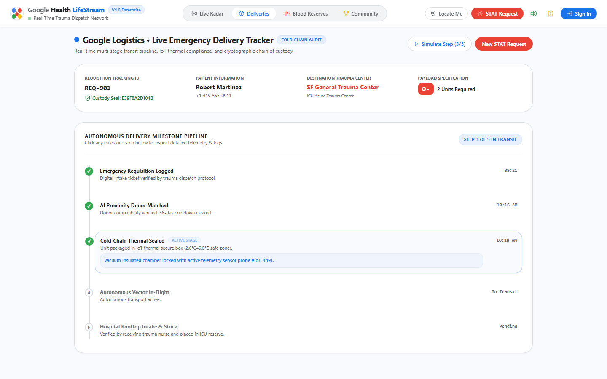
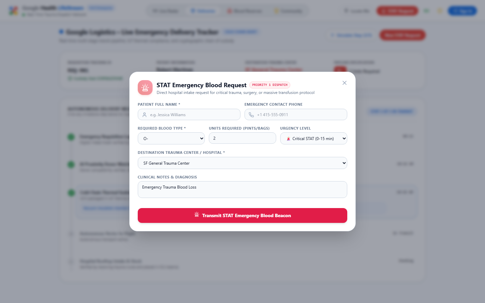
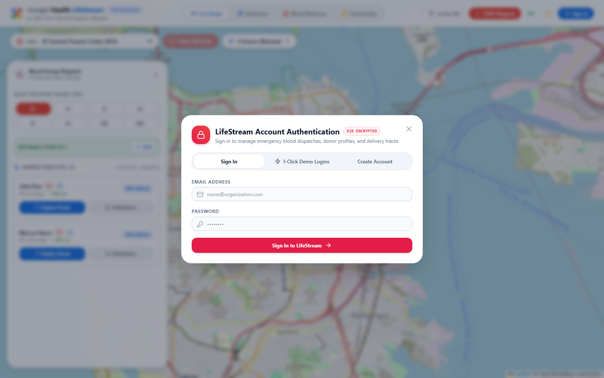

# 🩸 LifeStream Enterprise V4.0 — Project Showcase & Media Catalog

> **Autonomous Medical Emergency Blood Network & STAT Drone Dispatch**  
> *Google Health Standard • Real-Time Geospatial Radar • Cold-Chain IoT Telemetry (2°C–6°C)*

---

## 🌐 Live Deployment
- **Production URL**: [https://blood-match-api.vercel.app](https://blood-match-api.vercel.app)
- **Deployment Platform**: Vercel (Edge Serverless + Client SPA)
- **Architecture**: Node.js + Express REST API, React 18, Tailwind CSS, Leaflet.js

---

## 📸 Canonical Screenshot Gallery

### 1. Geospatial Live Radar Map
*Interactive San Francisco trauma centers, active donor beacons, and real-time GPS origin tracking.*

### 2. Regional Blood Reserves & Cross-Match Matrix
*5 regional trauma center inventories, clinical transfusion cross-matching (O- universal donor, AB+ universal recipient), and emergency shortage alarms.*

### 3. Community Heroes & Center Bookings
*Voluntary lifesaver leaderboard, verified donation count metrics, 5-point clinical health clearance, and appointment scheduling.*

### 4. Live Emergency Delivery Tracker (Cold-Chain IoT Surveillance)
*5-stage delivery pipeline, cryptographic SHA-256 Chain-of-Custody seal verification, and biological thermal compliance (2.0°C–6.0°C).*

### 5. STAT Emergency Blood Intake Portal
*Direct hospital emergency ticket generator for acute trauma and massive transfusion protocols.*

### 6. 1-Click Instant Evaluator Demo Switcher
*Pre-configured evaluation roles: Trauma Clinician, Verified Hero Donor, Emergency Patient, and Fleet Admin.*

---

## 🧪 Verification & Automated Testing
- **Test Command**: `npm test`
- **Results**: 5/5 automated unit tests passing in ~150ms:
  1. `✔ Haversine Geospatial Distance Calculation`
  2. `✔ Clinical Red Blood Cell Compatibility Matrix (Universal Donor Rules)`
  3. `✔ Clinical Plasma Compatibility Matrix (Universal Plasma Rules)`
  4. `✔ AI Donor Proximity & Reliability Scoring Engine`
  5. `✔ Cold-Chain IoT Thermal Regulation Simulation (2°C–6°C)`
